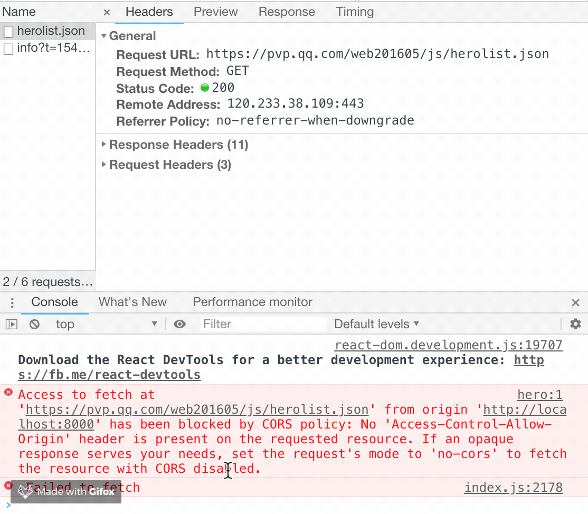

## 二、dva 数据请求

场景：在进入页面的时候，发起请求页面初始化数据。

#### /src/pages/dva/index.tsx

```js
const DvaPage = ({ index, dispatch }) => {
  useEffect(() => {
    dispatch!({
      type: 'dva/fetch',
    });
  }, []);
  const { herolist = [] } = dva;
  return <div className={styles.center}>Hello {JSON.stringify(herolist)}</div>;
}
```
然后在 effects 里面，响应这个事件。

#### /src/models/dva.ts

```js
import { request } from 'alita';

export interface DvaModelState {
  herolist: any[];
}

const DvaModel: DvaModelType = {
  namespace: 'dva',

  state: {
    herolist: [],
  },

  effects: {
    *fetch({ payload }, { call, put }) {
      const data = yield request('https://pvp.qq.com/web201605/js/herolist.json');
      yield put({
        type: 'save',
        payload: { herolist: data },
      });
    },
  },
  reducers: {
    save(state, action) {
      return {
        ...state,
        ...action.payload,
      };
    },
  },
};
```

当我们进入到首页发起请求时，打开浏览器调试，在 `console` 会看到以下情况：



- step1 首先我们查看了网络请求情况，正确响应200，并且已有数据返回(也可能存在数据未返回的情况，请继续往下看)
- step2 查看console，发现打印了一个错误

这个错误在web开发中，特别是前期接口调试的时候，是比较常见的错误，它说明了请求存在跨域访问情况。因为请求发生了错误，所以我们的代码直接就挂了。这里我们可以先处理代码挂掉的问题。

### 本章节代码

[github: feat-dva 分支](https://github.com/hang1017/alitaRequestDemo/tree/feat-dva)