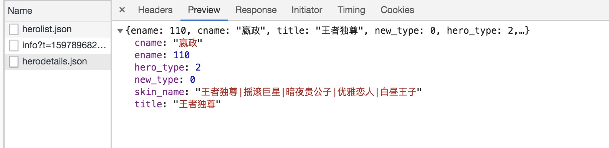

## mock 静态数据

在框架中使用mock，只要在 `./mock/` 文件夹下，新建js或ts文件，然后按照规范编写文档，就可以使用mock功能了。

将接口请求到的英雄列表数据复制出来黏贴到 `/mock/herolist.json`。

根目录下新建 `/mock/heros.ts`

```js
import herolist from './herolist.json';

export default {
  '/api/herolist.json': herolist,
};
```

保存代码后刷新页面，页面上一样展示了所有英雄的列表数据，为了验证 mock 数据是否请求成功。

这时我们注释掉 `config/config.ts` 下的 `proxy` 代理。

重启项目进入页面，能够看到不存在跨域报错，因为自动请求了 `mock` 的静态数据。

### mock请求携带参数

比如我们需要取得单个英雄的数据，我们就需要在请求里面携带参数。

#### /mock/heros.ts

```js
import { Request, Response } from 'express';
import herolist from './herolist.json';

export default {
  '/api/herolist.json': herolist,
  'POST /api/herodetails.json': (req: Request, res: Response) => {
    const { ename } = req.body;
    const hero = herolist.filter((item: any) => item.ename === parseInt(ename, 10))[0];
    res.send(hero);
  },
};
```

#### /src/models/dva.ts

```js
*fetch({ payload }, { call, put }) {
  const data = yield request('/api/herolist.json');

  const detailData = yield request('/api/herodetails.json', {
    method: 'POST',
    body: {
      ename: 110,
    },
  });
  console.log(detailData);
  yield put({
    type: 'save',
    payload: { herolist: data },
  });
},
```

请求携带了参数body，但是，到后端取不到数据。

### mock post 取不到参数

这里需要注意，我们需要为请求增加请求头，还有body，需要转成字符串。

#### src/app.ts

```js
export const request = {
  prefix: '', // 统一的请求头
  middlewares: [middleware],
  headers: {
    Accept: 'application/json',
    'Content-Type': 'application/json; charset=utf-8',
  },
  errorHandler: (error: ResponseError) => {
    // 集中处理错误
    console.log(error);
  },
};
```

```js
const detailData = yield request('/api/herodetails.json', {
    method: 'POST',
    body: JSON.stringify({
      ename: 110,
    }),
  });
```



### 本章节代码

[github: feat-mock 分支](https://github.com/hang1017/alitaRequestDemo/tree/feat-mock)

