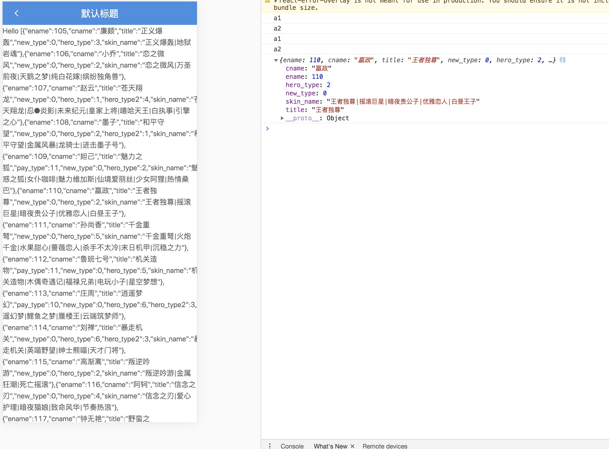

## dva 全流程数据管理

### 一、dva 基础

#### 1、Reducer

`reducer` 是一个函数，接受 `state` 和 `action`，返回老的或新的 `state` 。即：`(state, action) => state`。可以理解为更新数据刷新页面，你可以不需要知道什么 `reducer` 的增删改，像下面这样写一个通用方法。

```js
reducers:{
    save(state, {payload}) {
        return { ...state,...payload}
    },
},
```

#### 2、Effect

这个可以理解为一个接收事件的中间件，你在这里接受页面抛过来的事件，然后处理，比如请求服务器数据，然后，再抛个事件到 `Reducer`，更新页面。
示例：

```js
state:{
    assets:{},
},
*changeAssets({ payload }, { call, put, select }) {
    const data = yield call(doSomethingFunc, parameter);
    yield put({ type: 'save', payload: { assets:data } });
},
```

`call` 方法用于调用逻辑，可以理解为等待这个函数执行的结果，把值赋给 `data`，项目中常用于，返送 `http` 请求，等待服务端响应数据。

```js
const data =yield call(doSomethingFunc, parameter);
```

`select` 方法用于查找当前 `state` 的状态，比如此刻 `data = {assets:{}}`

```js
const data = yield select(state => state.namespace);
```

`put` 方法用于触发事件，可以是 `Reducer` 也可以是 `Effects`。

```js
yield put({ type: 'fetch', payload: { page } });
```

#### 3、Subscription

`subscriptions` 是订阅，用于订阅一个数据源，然后根据需要 `dispatch` 相应的 `action`。数据源可以是当前的时间、服务器的 websocket 连接、keyboard 输入、geolocation 变化、history 路由变化等等。格式为 `({ dispatch, history }) => unsubscribe` 。
项目中常用于页面初始化数据的自动请求，如：

```js
setup({ dispatch, history }) {
  return history.listen(({ pathname, query }) => {
    if (pathname === '/home') {
      // 进入首页了，自动做一些什么事情，比如发起一个Effects
      dispatch({
        type: 'query'
      })
    }
  });
}
```

#### 4、dispatch

和 `Effects` 中的 `put` 方法等同，用于不在 `Effects` 中要发起事件的情况下，比如从页面点击按钮发起请求。
(page中)

#### 5、connect

通过connect绑定数据,比如：

```js
import { connect } from 'dva';
import styles from './page.less';
function App({home,dispatch}) {
  const { assets } = home;
  return (
    <div className={styles.normal}>
      <h2>
        {JSON.stringfy(assets)}
      </h2>
    </div>
  );
}
export default connect(({home})=>({home}))(App);
```

以上内容，几乎包括了所有我们在实际项目中会使用到的所有知识。

需要强调的是，文中内容仅仅是我为了让大家便于理解，做了一些简化描述。

相关概念，大家可以在对umi稍微熟悉之后，参阅[官方文档](http://www.umijs.org/)。

声明：文中知识体系目录来自开源项目：[dva.js知识导图](https://github.com/dvajs/dva-knowledgemap)。

### 二、封装请求方法

首先在 `/src/services/api.ts` 下编写请求英雄列表和获取某个英雄详情请求接口的方式。

```js
import { request } from 'alita';

export async function queryHeroList(): Promise<any> {
  return request('/api/herolist.json');
}

export async function getHeroDetails(params: any): Promise<any> {
  return request('/api/herodetails.json', {
    method: 'POST',
    body: JSON.stringify(params),
  });
}
```

### 三、页面发起请求

#### /src/pages/dva/index.tsx

```js
const DvaPage: FC<PageProps> = ({ dva, dispatch }) => {
  // 发起请求
  useEffect(() => {
    dispatch!({
      type: 'dva/fetch',
    });
  }, []);

  // 获取仓库的 dva 中的数据
  const { heroList = [] } = dva;

  return <div className={styles.center}>Hello {JSON.stringify(heroList)}</div>;
};
```

### 四、dva 请求数据

```js
import { queryHeroList, getHeroDetails } from '@/services/api';

effects: {
  *fetch({ payload }, { call, put }) {
    const data = yield call(queryHeroList);
    const detail = yield call(getHeroDetails, { ename: 110 });
    console.log(detail);
    yield put({
      type: 'save',
      payload: {
        heroList: data,
      },
    });
  },
},
```



### 本章节代码

[github: feat-dva 分支](https://github.com/hang1017/alitaRequest/tree/feat-dva)


