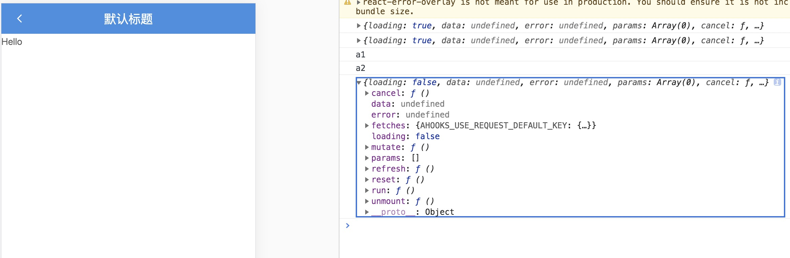
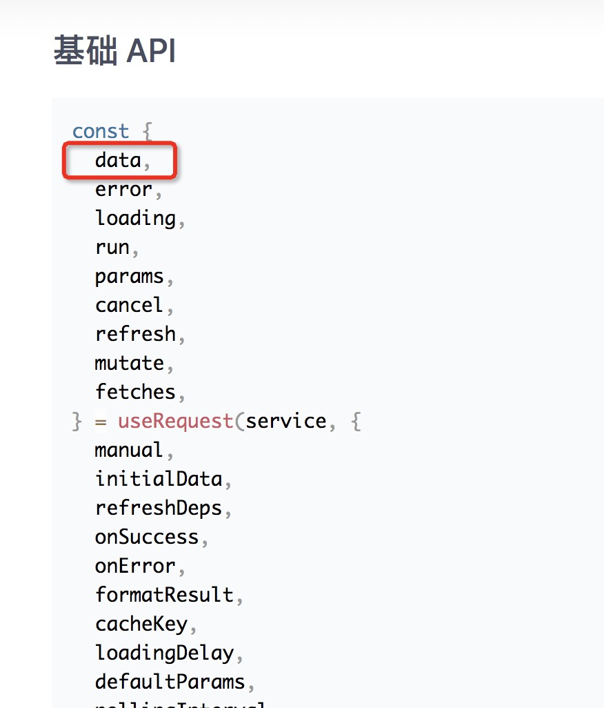
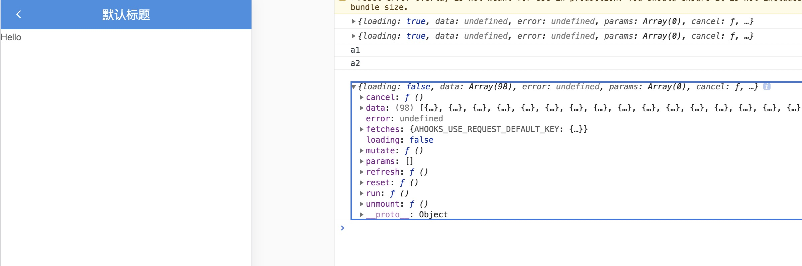

# 使用 hooks 请求方式

继续使用 `mock` 请求数据

## 一、第一种方式(useRequest)

#### /src/pages/hooks/index.tsx

```js
import { useRequest } from 'alita';
import { queryHeroList } from '@/services/api';

const HooksPage: FC<PageProps> = ({ dispatch }) => {
  const heroList = useRequest(queryHeroList);
  console.log(heroList);
  return <div className={styles.center}>Hello {name}</div>;
};
```



这时发现请求到的数据 `data` 为 `undefined`。

通过[官网API](https://ahooks.js.org/zh-CN/hooks/async/#%E9%BB%98%E8%AE%A4%E8%AF%B7%E6%B1%82)发现，请求到到的参数会取出参的 `data` 数据，但是 `queryHeroList` 请求到的是一个列表。



这时需要用 `formatResult` 格式化请求结果，对数据进行结构调整。

#### /src/pages/hooks/index.tsx

```js
const heroList = useRequest(queryHeroList, {
  formatResult: (e) => {
    return e;
  },
});
```



如果是非初始化的请求，可以设置 `manual` 修改成手动触发的效果。

#### /src/pages/hooks/index.tsx

```js
const heroList = useRequest(queryHeroList, {
  manual: true,
  formatResult: (e) => {
    return e;
  },
});

<Button onClick={() => heroList.run()}>获取数据</Button>
```

### 查询详情接口

#### /src/pages/hooks/index.tsx

```js
const HooksPage: FC<PageProps> = ({ dispatch }) => {
  const [heroDetail, setHeroDetail] = useState([]);
  const { run } = useRequest(queryHeroList);
  const detail = useRequest(
    () =>
      getHeroDetails({
        ename: 110,
      }),
    {
      onSuccess: (e) => {
        setHeroDetail(e);
      },
    },
  );

  console.log(detail);
  return (
    <div className={styles.center}>
      <Button onClick={() => run()}>请求数据</Button>
      Hello {JSON.stringify(heroDetail)}
    </div>
  );
};
```

## 第二种方式(async await)

```js
const initData = async () => {
  const data = await queryHeroList();
  console.log(data);
};

useEffect(() => {
  initData();
}, []);
```

### 本章节代码

[github: feat-hooks 分支](https://github.com/hang1017/alitaRequest/tree/feat-hooks)


