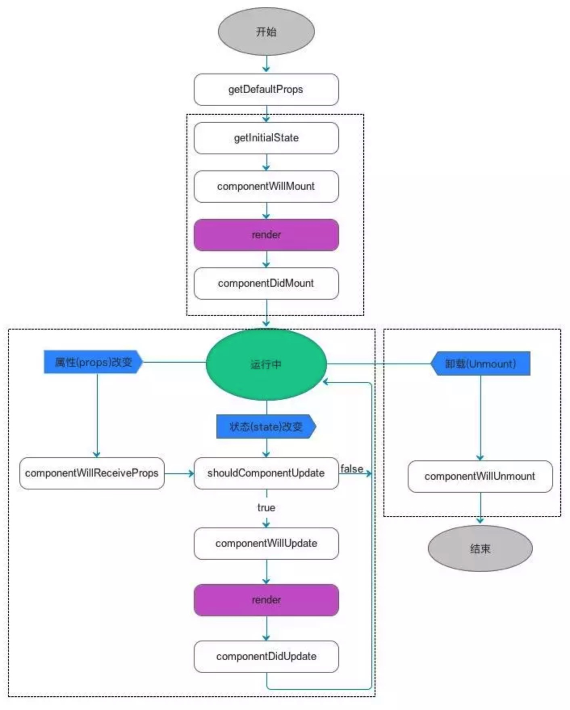
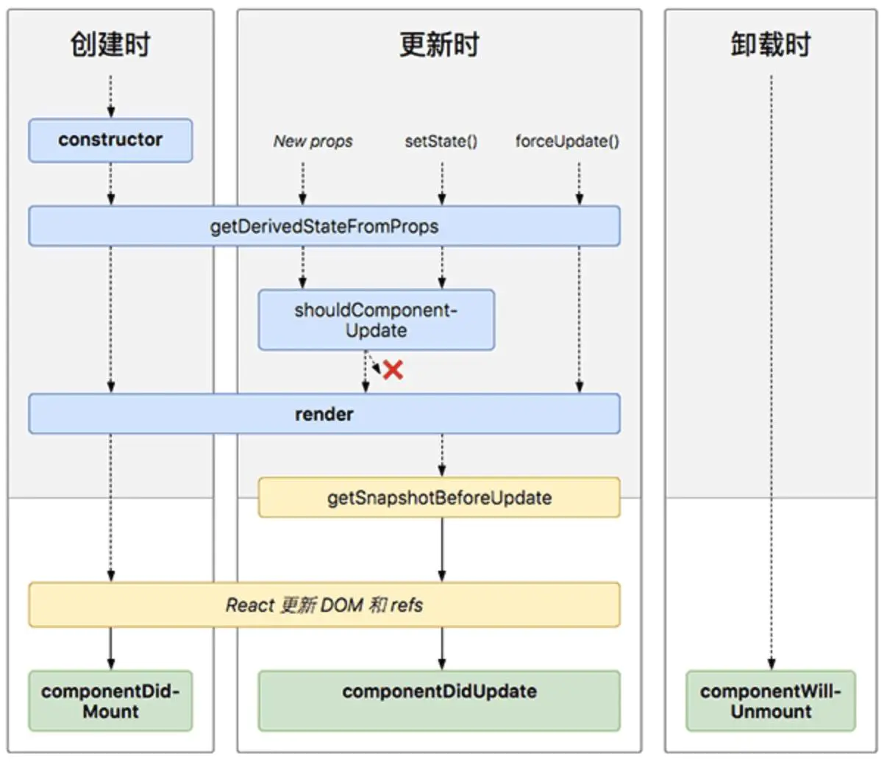

# 面试题

## 一、webpck

webpack 的面试题在同级目录下的 `webpack.md` 中的最下方。

## 二、基础题

### 1、什么是闭包

```js
function f1() {
  var n = 999;
  addN = function () {
    n += 1;
  };
  function f2() {
    alert(n);
  }
  return f2;
}
var result = f1();
result(); // 999
addN();
result(); // 1000
```

读取其他函数内部变量的函数。将函数内部和函数外部连通起来的一座桥梁。

当外部无法读取到 `函数1` 内部的局部变量时，在`函数1`内部再创建一个 `函数2`，`函数2` 用来输出 `函数1` 的局部变量，并且在 `函数1` return `函数2`

这样我们就能在外部访问到 `函数2`。以此来读取到 `函数1` 内部的局部变量。

作用有二：1、外部读取到内部的变量。2、让这些变量始终保持在内存中。怎么解释第二点呢

一般情况下，局部变量在调用结束之后会被垃圾回收策略回收。

但是因为 `f2` 被赋给一个全局变量，所以 `f2` 就始终在内存里，由因为 `f1` 是 `f2` 的父函数，`f2` 的存在依赖与 `f1`, 所以 `f1` 也始终在内存中。

缺点或者注意点：

1、闭包使函数中的变量被保存在内存中，内存消耗很大，不能滥用，否则会导致性能问题。最好在退出函数前，将不使用的局部变量全部删除。

2、闭包会在父函数外部，改变函数内部变量的值。不要随意去改变。

### 2、深浅拷贝的区别和用途

(1)、深浅拷贝的区别

- 浅拷贝：将原对象或者原数组的引用直接赋给新对象或者新数组，新对象或者新数组只是对原来的一个引用。
- 深拷贝：创建一个新的对象或数组，将原对象的各项属性的值拷贝过来，是值，不是引用。

(2)、为什么要使用深拷贝

希望在改变新对象或者新数组时，不改变原来的对象或者数组。

(3)、深拷贝第一层的数组元素的话

- 直接遍历
- slice
- concat

(4)、深拷贝第一层对象

`var copyObj = Object.assign({}, obj);`

(5)、有没有什么办法能够 copy 所有的层级的对象和数组

`var copyArr = JSON.parse(JSON.stringify(arry))`

(6)、immutable 解决方案

深拷贝很消耗性能，有时我们只是想改变一个对象内的值不修改原对象，但是深拷贝就会造成资源浪费。

```js
const { Map } require('immutable');
const map1 = Map({ a: 1, b: 2, c: 3 });
const map2 = map1.set(b: 100);
```

### 3、css 有哪些实现布局的方式

- table 布局
- flex
- float
- 响应式布局

media:

```css
/* 如果文档小于 300px */
@media screen and (max-width: 300px) {
  body {
    background-color: lightblue;
  }
}
```

### 4、css 命名冲突如何解决

(1)、修改 html

如果可以修改 html 的情况下，直接多添加一个 class 或者 id，就行了。

(2)、less 嵌套

(3)、细化选择符

`.container .abc {background:#fff}`

### 5、opacity: 0, visibility: hidden, display: none

`display`: 会让元素从渲染树中消失，渲染时不占任何空间，不可点击。子孙一起消失，会回流，性能消耗最大

`visibility`: 在渲染树中不会消失，继续占据空间，只是不可点击。子孙可以呈现出来

`opacity`: 渲染树不会消失，继续占据空间，可点击，只是不可见。子孙一起消失

### 6、不改变原代码的情况下,如何修改让图片保持 300px

1、设置 `max-width: 300px`

2、设置按比例缩放图片 `transform: scale(0.625)`

3、document.getElementByTagName('img')[0].setAttribute('style','width:300px !important');

### 7、['10', '10', '10', '10'].map(parseInt)

实际向 `parseInt` 传递的是字符串和基数。

所以其执行的效果是：

- parseInt('10',0);
- parseInt('10',1);
- parseInt('10',2);
- parseInt('10',3);

输出结果： 1，NaN，NaN

### 8、全局作用域中，const let 声明的变量在哪里

在全局作用域中，let 和 const 声明的全局变量并没有在全局对象中。而是在一个 块级作用域(Script)中。

### 9、使用 sort 对数组进行排序

`[102, 15, 22, 29, 3, 8]`

根据 MDN 上对 `Array.sort()` 的解释，默认的排序会讲数组元素转换为字符串，比较字符串中 UTF-16 编码顺序进行排序。

### 10、打印对称树

```js
var result = [];
for (let i = 0; i < 10; i++) {
  result.push(i * 11);
  for (let j = 0; j < 10; j++) {
    result.push(i * 101 + j * 10);
    result.push(i * 1001 + j * 110);
  }
}
```

### 11、实现全屏的方法

给要全屏的 `div` 加上 ref, `rootRef.current.requestFullscreen();` 即可实现。

## 三、react

### 1、react 的 key 有什么作用

react 中 diff 算法来保证每次组件的所有变动都能得到及时的更新，标准的 Tree Diff 算法复杂度为 O(n3)，若组件中的元素数量过多的话，其性能是无法承受的。

如果两个元素存在有不同的 `key`, 那么前后的两次的渲染就被认为是不同的元素，旧的元素被 `unmount`, 新的元素被 `mount`。

如果前后两次的渲染存在相同的 `key`，若属性更新，则更新对应组件的属性，若不更新，则不变化。

(1)、追加 insert 的情况

如果我们不加 `key`, 那么你在插入数据时，react 不会执行插入操作，直接移除不同的元素，然后 append 进去剩余的元素。损耗性能。

所以如果加 key,原先的数据并不是被删除了，而是被挪到下面去了。react 就会执行 insert 操作。

(2)、如何选择 key

key 的真正目的是为了标识前后两次渲染中元素的对应关系。在插入，排序，删除操作时，原先的 index 并不对应到原先的元素上，那么 key 就失去了意义。

参考下面的代码：

```js
var key = 0;
//可以是任何的id generator
function id() {
  return String(++key);
}
//任意的数组或者待遍历的数据
data.forEach((item) => {
  if (!item.id) {
    item.id = id;
  }
});
```

(3)、注意点

- key 值一定要和具体的元素一一对应。
- 尽量不要用 index 去作为 key
- 不要时试图加上不稳定的 key ，这样只会让性能更糟糕。

### 2、context

(1)、什么是 context

提供一个无需为每层组件手动添加 props，就能在组件数间进行数据传递的方法

在组件之间共享此类值的方法，而不必显式的通过组件树逐层传递 props

(2)、何时使用 context

设计的目的是为了共享那些对于一个组件树而言是 ‘全局’ 的数据。

很多不同层级的组件都需要访问一些相同的数据

(3)、代码教程

```js
// 创建 context，并设置默认值
const ThemeContext = React.createContext('light');

// 中间的组件也不必指明往下传递的 theme 了
<ThemeContext.Provider value='dark'>
  <Toolbar/>
</ThemeContext.Provider>

static contextType = ThemeContext;
return <Button theme={this.context} />
```

### 3、render props

(1)、什么是 render props

在 react 组件之间使用一个值为函数的 props 在 react 的组件间共享代码的简单技术

我的理解：一个组件通过 render 函数将里面的数据传递出来给另一个组件使用。

```js
// 在 Mouse 组件中提供可变数据源
render(){
  return (
    <div>{this.props.render(this.state)}</div>
  )
}

// 通过 render 函数将数据传递给 cat 组件
<Mouse render={mouse => {
  <Cat mouse={mouse} />
}}/>
```

(2)、什么时候用

当两个平级组件需要单向依赖的时候。

### 4、setState 什么时候更新

`setState` 是同步执行的，这里说的的同步异步问题是指：是否会立即执行，还是或者会多个 state 合并到一起批量执行。

什么时候会立即执行：1、事件处理函数 2、setTimeout

当 react 在自身生命周期内时，触发 isBatchingUpdates = true, 所以不会直接更新 state.

### 5、讲讲 React 生命周期？React v15 和 React v16 生命周期有啥变化？

react15 生命周期



挂载组件流程：`constructor` -> `componentWillMount` -> `render` -> `componentDidMount`

修改 `props` 数据流程: `componentWillReceiveProps` -> `shouldComponentUpdate` -> `componentWillUpdate` -> `render` -> `componentDidUpdate`

修改 `state` 数据流程: `shouldComponentUpdate` -> `componentWillUpdate` -> `render` -> `componentDidUpdate`



挂载组件流程: `constructor` -> `getDerivedStateFromProps` -> `render` -> `componentDidMount`

修改 `props` 数据流程: `getDerivedStateFromProps` -> `shouldComponentUpdate` -> `render` -> `getSnapshotBeforeUpdate` -> `componentDidUpdate`

修改 `state` 数据流程: 同上

**对比：**

- 弃用了 `componentWillMount`、`componentWillReceivePorps`，`componentWillUpdate`
- 新增 `getDerivedStateFromProps`、`getSnapshotBeforeUpdate`
- 17 版本将会删除弃用的三个生命周期

### 6、shouldComponentUpdate 是做什么的？如何用？

询问组件是否需要更新的一个钩子函数，判断数据是否需要重新渲染，返回一个布尔值。默认的返回值是 true，需要重新 render()。

若如果返回值是 false 则不触发渲染,利用这个生命周期函数可以强制关闭不需要更新的子组件来提升渲染性能。

这个方法用来判断是否需要调用 render 方法重新描绘 dom。

因为 dom 的描绘非常消耗性能，如果我们能在 shouldComponentUpdate 方法中能够写出更优化的 dom diff 算法，可以极大的提高性能。

## 四、babel

### 1、babel 的实现原理

通过将代码转换成抽象语法书(AST)，再转换成目标语法。
