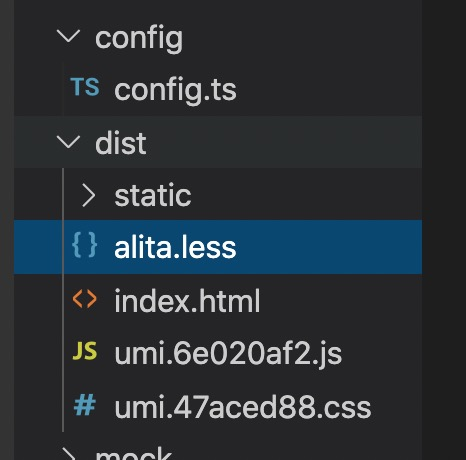
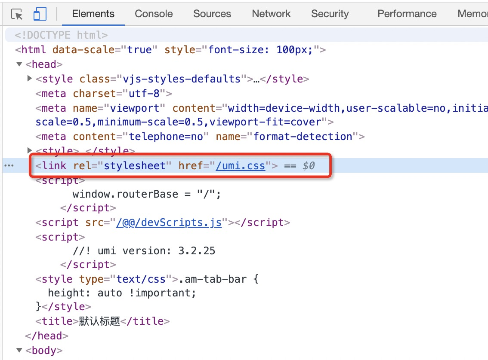
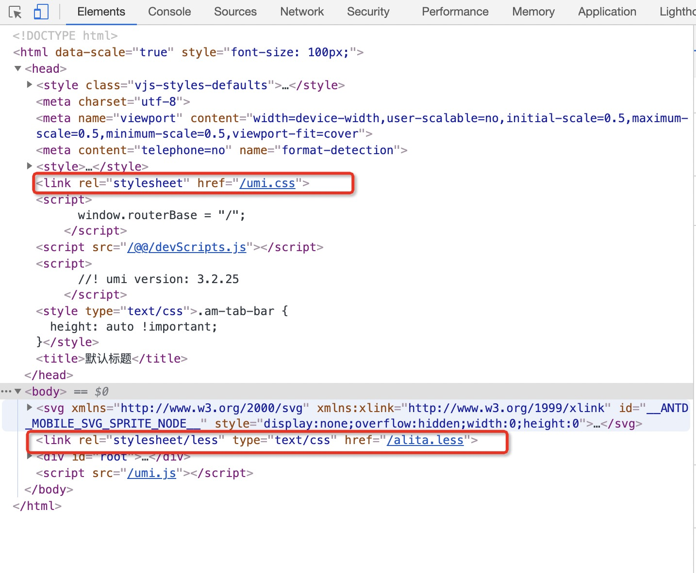
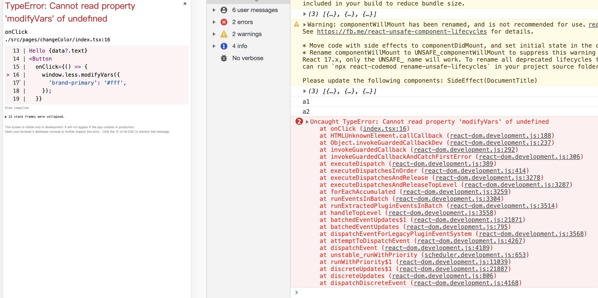

# @alitajs/plugin-theme 理解

## 基本用法

[如何在 umi 系项目中实现动态换肤](https://mp.weixin.qq.com/s/8cb6ZILbYvtBLPHHGOqsDQ)

可以在微信公众号对此文章进行基本用法的使用。下面简单举例：

```bash
yarn add @alitajs/plugin-theme
```

1、在项目 `/src` 文件夹下创建 `default.less` 样式文件。引入 `antd-mobile` 或 `antd` 并设置自定义样式变量。

```less
@import '~antd-mobile/lib/style/themes/default.less';
@hd: 1px; // 基本单位

@brand-primary: #108ee9;

@hang-color: #108ee9;
```

2、在 `config.ts` 上配置，样式文件路径和需要换肤的自定义变量

```js
import path from 'path';

export default defineConfig({
  ...
  plugins: ['@alitajs/plugin-theme'],
  dynamicTheme: {
    type: 'antd-mobile',
    varFile: path.join(__dirname, '../src/default.less'), // 如果不配置的话，默认读取 antdm 或者 antd 的样式文件
    themeVariables: ['@brand-primary', '@hang-color'],
  },
});
```

3、换肤功能业务代码：

```js
window.less.modifyVars({
  'brand-primary': '#fff',
});
```

## 源码理解

基于 `umi` 的可扩展的企业级前端应用框架，以插件和插件集，支持各种功能扩展和业务需求的理解。

开发一款插件，支持换肤功能。

文章中的开发思路：将包含 less 变量的 css 类提取出来，通过修改变量的值重新生成新的 css 类，再添加到 dom 中。

项目中关键的一步是 提取 `.css` 类文件，在 umi 中及提取 `umi.css` 文件。

文章的末尾**源码模块**，有 webpack 插件：[umi-theme-webpack-plugin](https://github.com/alitajs/umi-theme-webpack-plugin)

在换肤功能中引入该插件，并让用户在项目里的 `/config/config.ts` 中对 `umi-theme-webpack-plugin` 的属性进行自定义的配置。

### 1、注册插件

```js
api.describe({
  key: 'dynamicTheme',
  config: {
    default: {
      type: 'antd-mobile',
    },
    schema(joi) {
      return joi.object({
        type: joi.string().valid('antd', 'antd-mobile'),
        themeVariables: joi.array(),
        generateOnce: joi.boolean(),
        varFile: joi.string(),
        outputFileName: joi.string(),
      });
    }
  }
})
```

理解下上面的这段代码：

- key: 插件命名。
- config-default: 设置 `type` 的默认值。
- config-schema: 对用户可自定义的配置字段进行类型声明，若未设置字段声明，用户配置的属性无效。

自定义的配置字段可以在[umi-theme-webpack-plugin](https://github.com/alitajs/umi-theme-webpack-plugin)上查看该字段的含义。

- type：定义使用组件库类型，是 `antd` 还是 `antd-mobile`。默认为 `antd-mobile`。
- themeVariables：要动态更改的变量列表。
- generateOnce：是否只修改一次。
- varFile：可动态更改的样式文件路径。
- outputFileName：取到 umi.css 文件后生成的新的文件名称。

**项目中 `defaultOption` 为默认配置。**

### 2、修改 webpack 的配置

```js
import UmiThemePlugin from 'umi-theme-webpack-plugin';

const { userConfig, paths } = api;
const { dynamicTheme } = userConfig; // 获取用户配置的数据
const { type, ...ohter } = dynamicTheme;

const option = {
  ...defaultOption[type],
  ...ohter,
};

api.chainWebpack(webpackConfig => {
  webpackConfig.plugin('umi-theme').use(UmiThemePlugin, [option]);
  return webpackConfig;
})
```

修改了 webpack 配置后，打包 `@alitajs/plugin-theme`, `link` 到项目中。

把项目进行 `yarn build` 打包，`dict` 包下会生成 `alita.less` 的文件。这份文件就是 `umi` 编译后的 `css` 文件。



### 3、将生成的 `alita.less` 添加到 dom 上

在浏览器上我们能看到



元素 `header` 里包含了编译后的 `umi.css` 文件。

在该元素后追加生成的 `alita.less` 文件。

通过 umi 的插件 api ：`modifyDevHTMLContent` 和 `modifyProdHTMLContent` 方法。将生成的 `alita.less` 追加进项目元素中。

```js
api.modifyDevHTMLContent(async (defaultHtml, { req }) => {
  const a = new RegExp(option.outputFileName);
  const link = `
  <link rel="stylesheet/less" type="text/css" href="${join(api.config.publicPath as string, option.outputFileName)}" />`

  if (!(defaultHtml as string).match(a)) {
    defaultHtml = (defaultHtml as string).replace(link, "").replace(/<body>/gi, `<body>${link}`);
  }
  return defaultHtml;
})
```

`api.modifyDevHTMLContent` 提供的参数 `defaultHtml` 通过 `console` 打印可以得知，`defaultHtml` 为项目编译后的元素。

通过正则判断元素是否包含 `alita.less` 如果未包含，则将 `<link rel="stylesheet/less" type="text/css" href="${join(api.config.publicPath as string, option.outputFileName)}" />` 追加到元素 body 后。

至此，我们来看下业务项目启动后的浏览器元素。



通过代码使用 `less.modifyVars` 来修改变量样式。会出现以下的报错：



### 4、less 版本修改

通过上面的报错信息，我们可以在公众号-遗留问题中得知：

引入 `less@2.7` 的用 `window.less.modifyVars` 的方式可以。但是在项目中使用了less@3 ，使用 `import less from less`；`less.modifyVars` 的方式，就算 `javascriptEnabled` 设置为 true ，也是不能使用 `.bezierEasingMixin()`;

相关 Issues  https://github.com/mzohaibqc/antd-theme-generator/issues/41#issuecomment-768734824

插件中引入 `less@2.7.+` 的版本。

```js
api.addHTMLScripts(() => {
  return [
    {
      content: readFileSync(join(__dirname, 'less.min.js'), 'utf-8'),
      type: 'text/javascript'
    },
  ];
})
```

## 附加 `umi-theme-webpack-plugin` 源码理解(粗略)

代码地址：https://github.com/alitajs/umi-theme-webpack-plugin/blob/master/index.js

`umi-theme-webpack-plugin` 插件的作用在于 `webpack` 构建环节中，读取了 `umi` 编译后的 `css` 文件，并支持 `umi-theme-generator`。

`compiler.hooks.emit.tapAsync('AntDesignThemePlugin', (compilation, callback) => {})`

`compilation` 应该为编译的文件和内容。

通过遍历 `compilation.assets` 获取到 `umi.css` 的文件，并赋值给 `this.colors` 属性。

并将文件内容，和文件大小通过一下代码赋值进去。

```js
compilation.assets[options.outputFileName] = {
  source: () => css,
  size: () => css.length
};
```

若已经存在 `this.colors` 字段则说明已经生成了 `css` 文件，直接赋值即可。

## 总结

开发和方案设计思路还是比较关键。

在使用 `less.modifyVars` 修改变量时，发现报错不能用。在数次百度后，引入新的 `less` 版本文件在项目中进行测试无果。在被师傅告知开发原理时，还是无法想到用插件的形式去实现这个需求。第一眼过源码的时候虽然还是没办法理解，但是确实有些惊艳，为什么自己就没想到用插件的形式去实现。以及就算自己想到以插件的形式去实现，还是无法独自完成开发。每一步对我来说都是难点，如何提取样式文件元素等。

插件作者开发使用4天，而我从阅读原理到写完这篇博客也花了4天的时间。从单纯阅读 `@alitajs/plugin-theme` 到发现 `umi-theme-webpack-plugin` 也被进行改造，以及最后对 `umi-theme-webpack-plugin` 的一些内容进行理解。`umi-theme-webpack-plugin` 的阅读确实对我还是有比较大的难度，看了很久最后来了些灵感，最后写下第三节 `附加 `umi-theme-webpack-plugin` 源码理解`。

## 测试 @alitajs/plugin-theme 发现问题

1、若引入 `@alitajs/plugin-theme` 插件，自定义变量初始值存在 `rgba` 的话，页面会报错。

2、若自定义变量使用 `green` 这中定义，使用 `less.modifyVars` 无法正常的修改。导致我一直以为是我用法不正确或者插件有误，从而反复查看知乎和公众号的文章。


