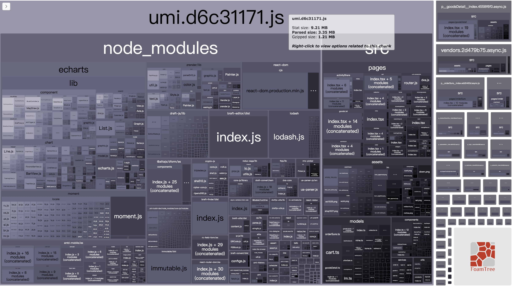
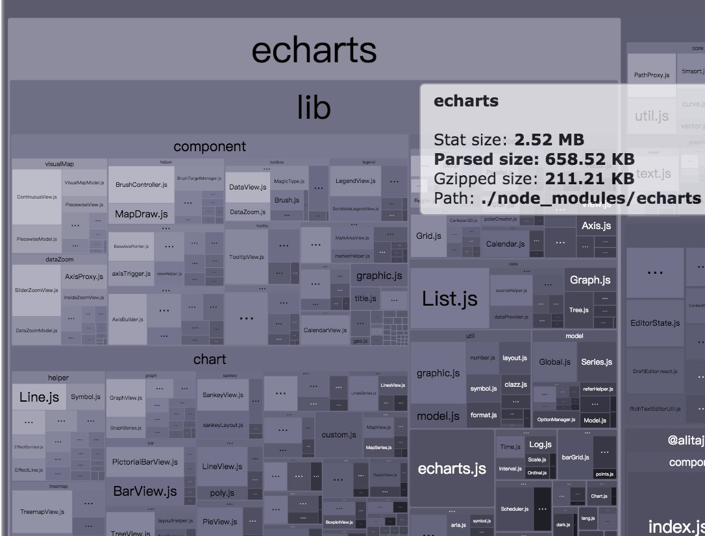
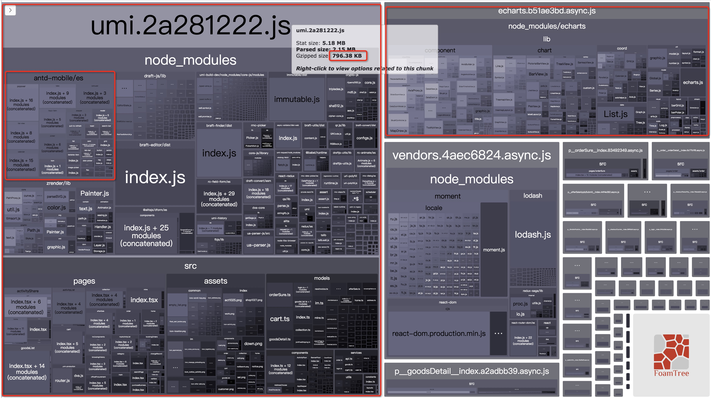

# H5 分包实现首屏加载时间优化

## 一、为什么首屏加载需要优化

因为做了很多事情：

初始化 webView -> 请求页面 -> 下载数据 -> 解析HTML -> 请求 js/css 资源 -> dom 渲染 -> 解析 JS 执行 -> JS 请求数据 -> 解析渲染 -> 下载渲染图片

在 `dom渲染` 之前用户看到的都是白屏，在 `下载渲染图片` 后，用户才能看到完整的页面。首屏秒开优化就是要减少这个过程的耗时。

扣除网络差的原因，对首屏启动速度影响最大的就是网络请求。由于业务需求，导致我们不得不引入很多第三方包来实现功能，这些包恰恰会容易影响到网络请求。

**这里我们把大体积的包，分成多个小体积的包进行加载，减少请求时间**

## 二、分析产物

通过分析产物来查看打出来的包内容占比

```bash
yarn build
```

打完包后如果出现下面黄色文字，说明打出来的包体积过大，我们用百度翻译来看下解释：


```
束的大小明显大于推荐值。
考虑使用代码拆分来减少它：https://goo.gl/9VhYWB
您还可以分析项目依赖关系：https://goo.gl/LeUzfb
```

你的包大小超过了推荐值，可以通过分析项目依赖进行的分包处理。

在 `umi` 和 `alita` 项目中，执行 `ANALYZE=1 umi build` 或 `ANALYZE=1 alita build` 来分析下产物。



我们可以看到经过压缩后的 `umi.js` 还有 `1.2M` 的大小。



`umi.js` 下最大的包是笔者引入的 `echarts`，有 `211kb` 的大小，这里只是引入了一个 `echart` 包，如果项目中，多引入一些大体积包的话，那么 `umi.js` 的大小就不是 `1M` 而会更大，在首屏加载时，请求这些数据就严重影响到了下载和渲染时间。

**这时，对包的拆解就显得尤为重要了。**

## 三、分包实现

打开 `config/config.ts` 文件(如果是 `umi2` 的项目则是 `.umirc.js`)

```js
export default {
  chainWebpack(config) {
    config.optimization.splitChunks({
      chunks: 'all',
      automaticNameDelimiter: '～',
      name: true,
      minSize: 30000,
      minChunks: 1,
      cacheGroups: {
        vendors: {
          name: 'vendors',
          test: /[\\/]node_modules[\\/](react|react-dom|react-router|react-router-dom|lodash|lodash-decorators|redux-saga|re-select|dva|moment)[\\/]/,
          priority: -10,
          enforce: true,
        },
        echarts: {
          name: 'echarts',
          test: /[\\/]node_modules[\\/](echarts)[\\/]/,
          priority: -11,
          enforce: true,
        },
      }
    })
  },
  chunks: ['vendors', 'echarts', 'umi'],
}
```

我们先看下 `cacheGroups` 下的属性，其他属性在下文中会讲解，先实现需求为重。

`cacheGroups` 下的属性为 `key-value` 的对象形式，`key` 可以自行命名，那 `value` 的值呢，我们继续往下看： 

- `name`: 拆分块的名称，提供字符串或函数使您可以使用自定义名称,如果 `name` 与 `chunks` 名称匹配，则进行拆分。
- `test`: 正则匹配路径，符合入口的都会被拆分，装到 `name` 名称下的包中。
- `priority`: 拆包的优先级，越小优先级越高。
- `enforce`: 不管这个包的大小，都会进行分包处理。

现在我们再执行 `ANALYZE=1 umi build` 看看效果：



`echarts` 包已经从 `umi.js` 中拆分出来，`umi.js` 的大小缩小到 `800K` 左右，这时通过 `yarn build` 打包不会才提示包过大的内容了。但是为了进一步演示，我们可以把上图中较大的包如 `antd-mob ile` 或者 `antd` 组件库的包也分出来。

在上面的代码 `cacheGroups` 中补充：

```js
antdm: {
  name: 'antdm',
  chunks: 'all',
  test: /[\\/]node_modules[\\/](@ant-design|antd|antd-mobile)[\\/]/, // 这里模拟有 antd 的情况，请根据实际项目具体考虑分析
  priority: -12,
  enforce: true,
},
```

```js
chunks: ['vendors', 'echarts', 'umi', 'antdm'],
```


由图得知，组件库的包被分出来了 `umi.js` 由变小了一点点。

这里补充一点呢，不建议拆分太小包，比如上述的 `antdm` 因为意义不大。

## 四、解析 splitChunks

第三大点，我们着重分析了 `cacheGroups`, 现在我们来分析下其余的字段，[官网文档](https://webpack.js.org/plugins/split-chunks-plugin/)有解析，不过感觉对于有些像我这样的初学者来说阅读起来会比较生涩一点，所以也可以下文中我对某些字段的解释，应该会来的通俗易懂一点点。

`chunks`: 有效值为：`all|async|initial`

| 参数    | 含义                                                                        |
| ------- | --------------------------------------------------------------------------- |
| all     | 把动态和非动态模块同时进行优化打包；所有模块都扔到 vendors.bundle.js 里面。 |
| async   | 把动态模块打包进 vendor，非动态模块保持原样（不优化）                       |
| initial | 把非动态模块打包进 vendor，动态模块优化打包                                 |

- 动态引入模块: `import ('lodash')`
- 非动态引入模块: `import 'react'`

笔者推荐一篇文章详细讲解了 `chunks` 参数的含义：[webapck4 玄妙的 SplitChunks Plugin](https://juejin.im/post/5c08fe7d6fb9a04a0d56a702)

`maxAsyncRequests`: `async` 时并行请求的最大数量。在做一次按需加载的时候最多有多少个异步请求，为 1 的时候就不会抽取公共 chunk 了

`maxInitialRequests`: `initial` 时并行请求的最大数量。同上。

`minChunks`: 拆分前必须共享模块的最小块数。指某个模块最少被多少个入口文件依赖。当大于等于minChunks设定的值时，该模块就会被打包到公用包中。小于这个值时，该模块就会被和每个入口文件打包在一起。

`minSize`: 被拆分出的bundle在拆分之前的体积的最小数值，只有 `>= minSize` 的bundle会被拆分出来。

`maxSize`: 被拆分出的bundle在拆分之前的体积的最大数值，默认值为0，表示bundle在拆分前的体积没有上限。maxSize如果为非0值时，切忌小于minSize。


