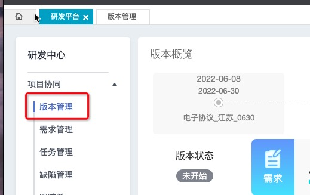

# 研发云需求单-任务单流程

## 准备工作(重要)

**先将文件夹【file】下的三个文件复制到你项目的根目录下。如果有可以忽略。**

访问 [zcm 研发云](https://dev.iwhalecloud.com/portal/main.html?portalId=3&projectId=562574) 的链接进行登录。右上角选择 **fz_app** 的项目(如果没有的话，找郑敬勤或者陈申权帮忙增加权限)。

进入项目后先切换


接下来会分需求单和任务单两个模块来说。

可以根据你手上的单子类型去看对应的模块。

## 需求单

### 新建版本

在【研发平台】模块左侧，找到【版本管理】模块点击进入。



点击进入后看下是否有符合当前要建需求单的版本。

**要看下表格里的周期栏，要保证自己建的需求单在周期时间内。**

若没有符合自己项目的版本，则点击【新增版本】按钮进行创建。

版本命名请按已有的版本规范来命名。

产品版本、产品分支若不清楚，可以咨询下上述两位老板。

开始时间可以设置为创建版本的当天或者当月的月初。

结束时间统一设置为月末，这样，不论当月有多少需求，都统一在一个版本里好管理。

### 创建需求单

在【研发平台】模块左侧，找到【需求管理】模块。

点击【新增需求】按钮进行需求创建。

填写【标题】、【描述】的内容。

右侧要注意【鲸加项目】和【版本】的选择，这里若与工时挂钩的话，就咨询下上述两位老板。剩余的内容就按默认来处理即可。

点击【保存】按钮即可创建需求单。


### 创建任务单(研发单)

找到当前创建的需求，点击详情进入需求单详情页，点击【新增任务】按钮。


去创建该需求单下的任务单。

这里要注意下鲸加项目的选择。

任务单创建完成。

任务单的流程在下面的章节会说，这里先跳过。

### 需求单自测报告

打开需求单详情，选中测试用例的模块


填写测试报告的内容。并点击【保存并设置为已通过】的按钮。


### 单子流转

完成自测报告后可以切换当前需求单的状态，根据实际情况转给对应的人，或者自行关闭。


## 任务单

在【研发平台】模块左侧，找到【任务管理】模块点击进入。


选中当前的任务单，进入任务单详情。

### 拉取特性分支

点击【代码分支】去【新建特性分支】


这里的分支命名请按下面的截图来命名。如果是修复 bug 的可以以【fix-xxx-xxx】。

这里注意下命名的单号是任务单的单号！

这里注意下命名的单号是任务单的单号！

这里注意下命名的单号是任务单的单号！

然后选下分支来源，这意味着这个分支是基于哪个分支拉出来的。


看到下面的截图就可知道该分支已经创建成功。点击分支名称就可以打开该项目的 git 地址。


并且在项目分支上可以找到我们新创建出来的特性分支。


## 代码提交

接下来我们的需求就在这个分支上进行研发。

当研发完成后要注意提交的内容：

`单号+空格+需求内容`

**这个很重要，否则你的内容提交不到远程仓库上！**


当然这个时候如果你不小心写错了提交内容，导致整个提交内容被暂存到本地仓库。那么可以使用 `git commit --amend` 修改提交记录。修改后重新提交即可。

若出现多人研发的情况容易产生提交冲突。

所以在提交到远程仓库前，请按顺序执行以下代码：

```bash
git fetch

# 变基 master 的分支
git rebase origin/master
```

如果变基的时候发生了冲突，那么解决冲突。

冲突解决完后

```bash
git rebase --continue

git add .
```

最后执行提交的功能

```bash
# 强制提交到远程仓库
git push -f
```

当完成特性分支的需求研发后，去提个 pr，实现分支合并。

在创建合并时，若出现合并失败的情况很可能是因为两个分支的代码存在冲突导致的，可以执行下上面的 `rebase` 来解决。


## 自测报告

完成特性分支的编写后，打开自测说明的 tab 编写内容，这里和 zmp 上的 new ins 差不多，要好好写，公司会有抽查。


完成编写后，选中【保存并设置为已通过】的按钮，保证【用例状态】为【已通过】。

接下来我们将单子进行流转，切换到测试中，看是否需要转给现场测试人员进行测试，如果不需要的话，可直接关闭该单子。


