# 项目从 zmp 迁移至 zcm 研发云的流程

## 准备工作(重要)

**先将文件夹【file】下的三个文件复制到你项目的根目录下。**

访问 [zcm 研发云](https://dev.iwhalecloud.com/portal/main.html?portalId=3&projectId=562574) 的链接进行登录。右上角选择 **fz_app** 的项目(如果没有的话，找郑敬勤帮忙增加权限，或先咨询下陈申权)。

## 创建目录

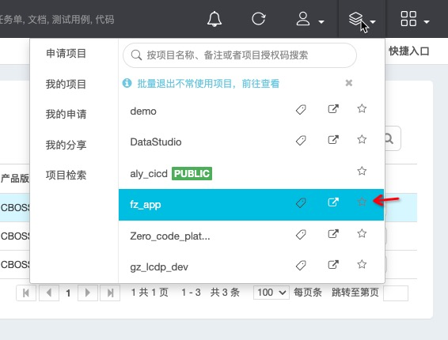

点开研发平台的 tab，选择仓库管理的目录：

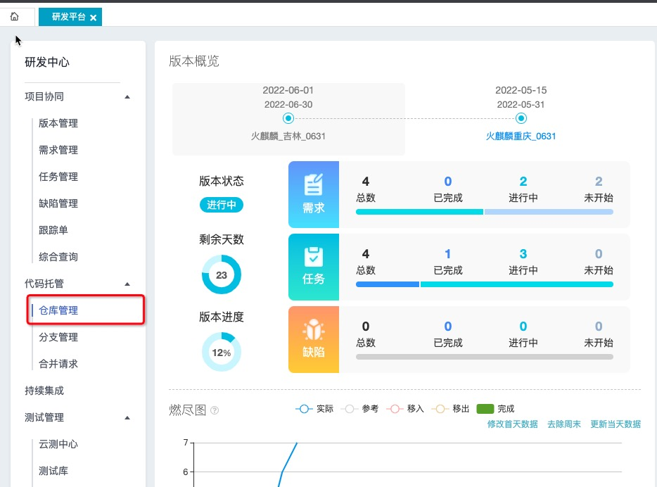

点开后会看到我们先有的所有目录：

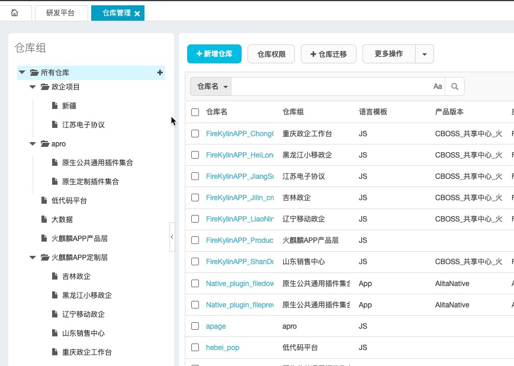

在钉钉群里搜索【陈惠明】小姐姐,请她帮忙给项目增加目录，项目增加目录的位置是有要求的，所以请先找上述两位老板确认新增项目的目录位置，确认好后再和陈惠明沟通。

## 仓库迁移

当仓库创建好后，在仓库管理模块选中新建的仓库。点击【仓库迁移】的按钮。

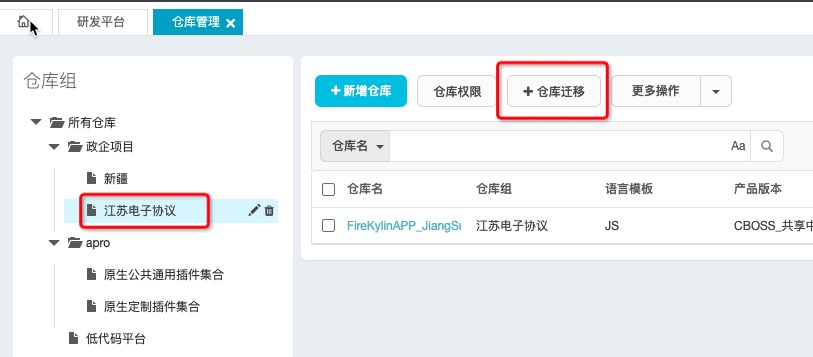

将现有的项目 git 地址填入表单，**仓库名称要规范，不可随意命名，所以请先咨询上面两位老板，确认清楚后再填入**。

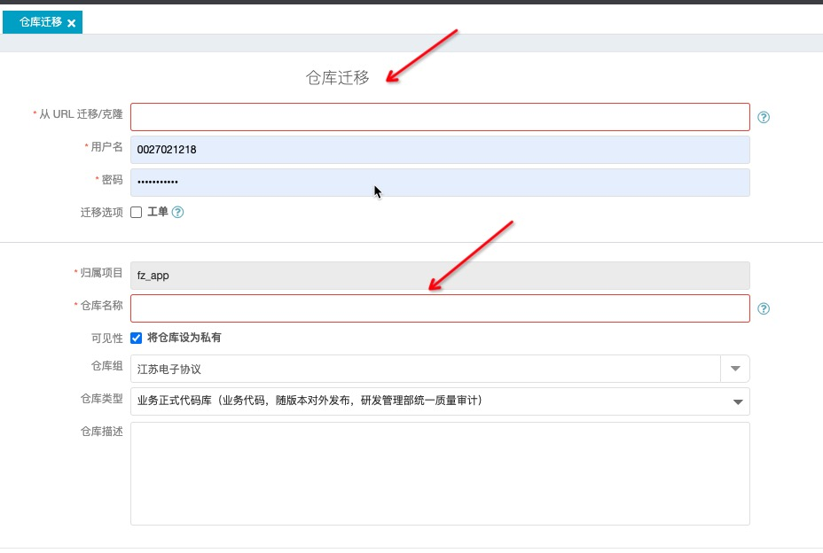

## 仓库信息完善

进入仓库编辑页面

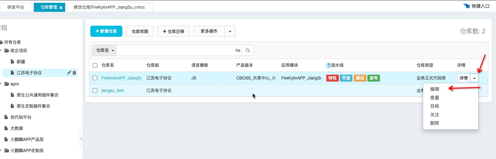

在完善信息之前，我们需要再次找到【陈惠明】让她为我们的项目增加【产品分支】。

这里我们找上述两位老板确认完产品分支的名称后，将产品分支的名称和新仓库的 git 提供给【陈惠明】。

创建完产品分支后，我们需要手动填入仓库名称、选择产品版本、选择应用模块(即我们刚沟通过的产品分支)。

剩下的内容可忽略，比如分支策略等，按默认处理即可。

## 创建构建

在研发平台的 tab 下选择【持续集成】的模块。

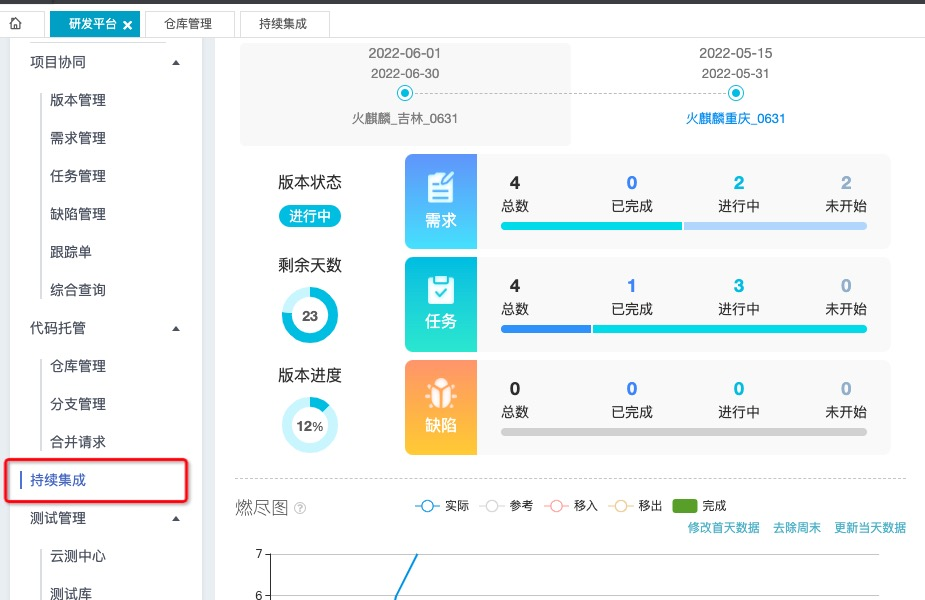

进入【持续集成】的模块后点击【新建构建】的按钮会看到下面的页面

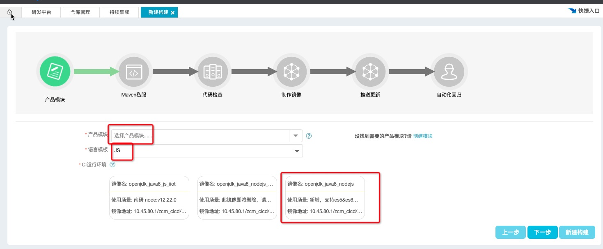

产品模块选择我们新增的产品分支，语言选择 js，运行环境选择图中圈起来的环境。

然后我们只需要一直点击下一步，知道新建构建即可。

新建完构建我们还需要完善构建流程，我们可以过滤搜索我们创建出来的构建，点击【修改】按钮。

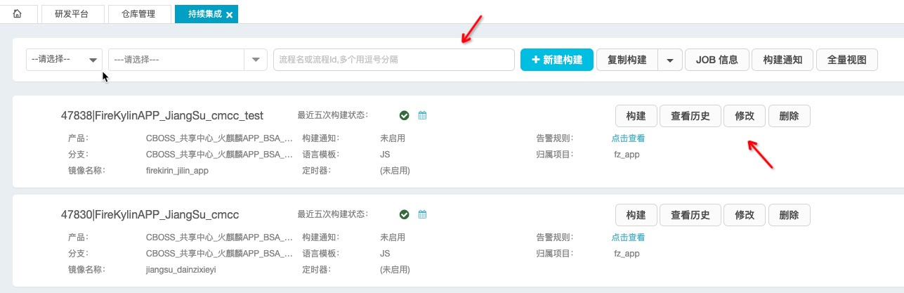

选择【代码下载】的模块，按着下图的内容进行填写。

代码路径写自己项目的代码路径，下载分支写要构建的分支名称。

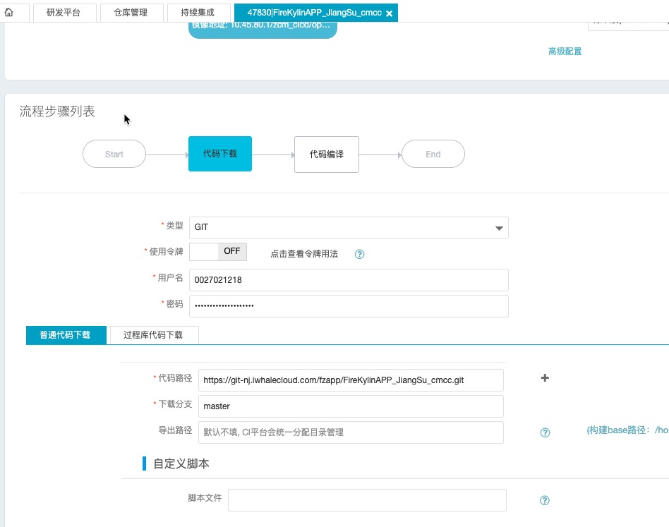

选择【代码编译】的模块，按这下图的内容进行编写。

这里要注意的是命令的表单是基于 `./deploy.sh` 放在仓库的根目录下。否则这里的内容需要修改。具体修改可咨询上述的两位老板。

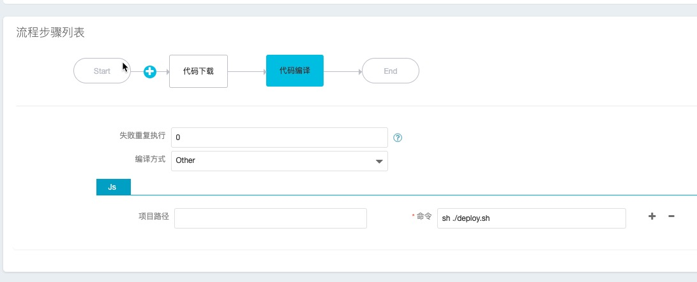

保存完内容，进入到【持续集成】的页面，点击构建，去尝试构建我们创建的构建流程。

这个构建预计要有个 10 分钟的时间。

如果成功，说明我们成功的走完了整个流程。如果不成功，请咨询上述的两位老板。
